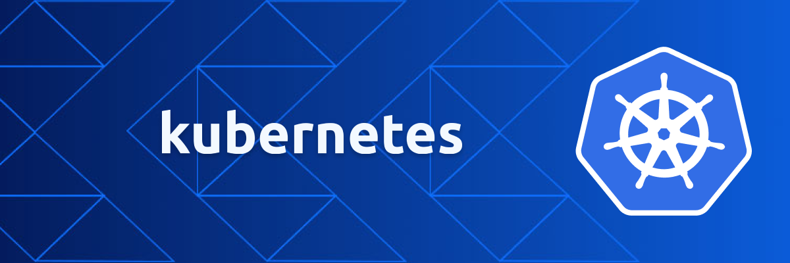
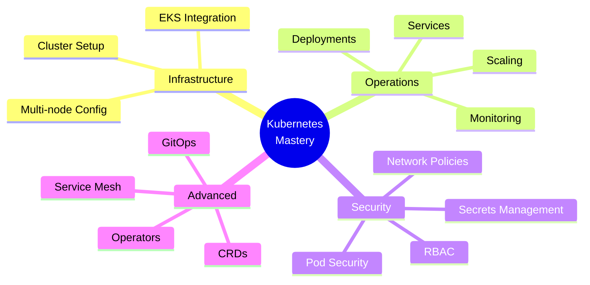

<div align="center">



# 🎯 Kubernetes Hands-On Labs
### *From Zero to Cloud-Native Hero*

[](https://kubernetes.io/)
[](https://aws.amazon.com/eks/)
[](LICENSE)
[](CONTRIBUTING.md)

**27 Progressive Labs** • **3 Learning Tracks** • **Production-Ready Skills**

[📖 View Labs](#-lab-catalog) • [🚀 Quick Start](#-quick-start) • [💡 Learning Paths](#-learning-paths)

</div>

---

## 🌟 Why This Repository?

> **Real learning happens through practice.** This repository transforms Kubernetes theory into hands-on mastery.

| 🎓 **Learn by Doing** | ☁️ **Cloud-Native Focus** | 🏆 **Production Ready** | 🔄 **Always Updated** |
|:---:|:---:|:---:|:---:|
| Every concept backed by practical labs | Deep AWS EKS integration | Industry best practices | Latest K8s versions |

---

## 📚 Lab Catalog

### 🏗️ Foundation Series: K8S (11 Labs)
> **For:** Complete beginners to intermediate users  
> **Time:** 3-4 weeks  
> **Goal:** Solid Kubernetes fundamentals

| # | Lab | Focus Area | Skills |
|:---:|---|---|---|
| **00** | [Cluster Setup (Terraform)](./00_create-kube-cluster-terraform) | Infrastructure | IaC, Cluster Bootstrap |
| **01** | [Installing on EC2](./K8S-01-installing-on-ec2-instance) | Setup | Manual Installation, kubeadm |
| **02** | [Basic Operations](./K8S-02-basic-operations) | CLI Mastery | kubectl, Resources, Debugging |
| **03** | [Networking & Discovery](./K8S-03-networking-service-discovery) | Networking | Services, DNS, Communication |
| **04** | [Pods & Volumes](./K8S-04-pods-volumes) | Storage | PV, PVC, Volume Types |
| **05** | [Secrets & ConfigMaps](./K8S-05-secrets-configmap) | Configuration | Config Management, Security |
| **06** | [Microservices & HPA](./K8S-06-microservice-deployment-and-autoscaling) | Scaling | Deployments, Auto-scaling |
| **07** | [EKS Fundamentals](./K8S-07-eks-01-managing-kubernete-cluster-with-eks) | Cloud | AWS EKS, Managed K8s |
| **08** | [Dynamic Volumes & Ingress](./K8S-08-eks-02-DynamicVolumeProvisioninig-and-Ingress) | Advanced Networking | Storage Classes, Ingress |
| **09** | [Pod Scheduling](./K8S-09-pod-scheduling) | Orchestration | Node Selection, Affinity |
| **10** | [Health Probes](./K8S-10-Liveness-Readiness-and-Startup-Probes) | Reliability | Liveness, Readiness, Startup |
| **11** | [Helm Basics](./K8S-11-helm-basic-operations) | Package Mgmt | Charts, Releases, Templating |

### 🚀 Advanced Series: Extra (15 Labs)
> **For:** Experienced users seeking production expertise  
> **Time:** 5-6 weeks  
> **Goal:** Platform engineering skills

| # | Lab | Focus Area | Skills |
|:---:|---|---|---|
| **01** | [EKS + ALB + Ingress](./Extra-01_eks-03-AWS-EKS-ALB-ingress) | Cloud-Native LB | AWS ALB Controller, Advanced Routing |
| **02** | [Resource Mgmt (Extended)](./Extra-02_extendend-version-kubernetes-resource-requirements-and-limits) | Optimization | QoS, Resource Quotas |
| **03** | [Resource Requirements](./Extra-03_kubernetes-resource-requirements-and-limits) | Fine-tuning | Requests, Limits, OOM |
| **04** | [Container Args & Commands](./Extra-04_pods-args-and-command) | Customization | Entrypoint, CMD Override |
| **05** | [Network Policies](./Extra-05_networkpolicy) | Security | Zero Trust, Segmentation |
| **06** | [RBAC & ServiceAccounts](./Extra-06_serviceaccounts-and-RBAC-authorization) | Access Control | Roles, Bindings, Permissions |
| **07** | [DaemonSets, Jobs, CronJobs](./Extra-07_daemonsets-jobs-cronjobs) | Workload Types | Batch Processing, System Daemons |
| **08** | [Multi-Container Pods](./Extra-08_multiple&&init-container-pods) | Design Patterns | Sidecar, Init, Ambassador |
| **09** | [Security Contexts](./Extra-09_security-context) | Hardening | RunAsUser, Capabilities, SELinux |
| **10** | [Deployment Strategies](./Extra-10_blue-green-canary-deployment-strategy) | Release Mgmt | Blue-Green, Canary, Progressive |
| **11** | [Admission Controllers](./Extra-11_Admission-Controllers) | Policy | Validation, Mutation, Webhooks |
| **12** | [Custom Resources (CRDs)](./Extra-12_customeresourcedefinitions) | Extensibility | API Extension, Custom Controllers |
| **13** | [Cluster Upgrades](./Extra-13_upgrade-cluster) | Maintenance | Version Migration, Zero-Downtime |
| **14** | [Auth & AuthZ](./Extra-14_Authentication-Authorization) | Security | Users, Groups, Auth Providers |
| **15** | [Headless & Custom Services](./Extra-15_headless-service-and-services-without-selectors) | Advanced Patterns | StatefulSets, External Services |

---

## 💡 Learning Paths

<table>
<tr>
<td width="33%">

### 🌱 Beginner
**Duration:** 2-3 weeks

**Week 1**
- Lab 00, 01, 02, 03

**Week 2**  
- Lab 04, 05, 06

**Week 3**
- Practice project

**Outcome:**  
✅ Deploy apps  
✅ Manage resources  
✅ Basic troubleshooting

</td>
<td width="33%">

### 🚀 Intermediate
**Duration:** 3-4 weeks

**Week 1-2**
- Lab 07, 08, 09, 10

**Week 3**
- Lab 11, Extra-01

**Week 4**
- Production project

**Outcome:**  
✅ EKS proficiency  
✅ Helm mastery  
✅ Production deploys

</td>
<td width="33%">

### ⚡ Advanced
**Duration:** 5-6 weeks

**Week 1-2**
- Extra 02-06

**Week 3-4**
- Extra 07-10

**Week 5-6**
- Extra 11-15

**Outcome:**  
✅ Platform engineering  
✅ Security hardening  
✅ Custom operators

</td>
</tr>
</table>

---

## 🚀 Quick Start

```bash
# Clone the repository
git clone <your-repo-url>
cd kubernetes-labs

# Verify prerequisites
kubectl version --client
terraform --version
aws --version

# Start with Lab 00 or 01
cd 00_create-kube-cluster-terraform
```

### ✅ Prerequisites Checklist

- [ ] AWS Account with admin access
- [ ] `kubectl` CLI installed ([install guide](https://kubernetes.io/docs/tasks/tools/))
- [ ] `aws` CLI configured ([install guide](https://aws.amazon.com/cli/))
- [ ] `terraform` installed (for infrastructure labs)
- [ ] Basic Linux/Unix command knowledge
- [ ] Understanding of containers and Docker

---

## 🎯 What You'll Master

<div align="center">



</div>

### Core Competencies

| 🏗️ **Infrastructure** | ⚙️ **Operations** | 🛡️ **Security** | 🚀 **Advanced** |
|---|---|---|---|
| Cluster provisioning | Workload management | RBAC & policies | Custom resources |
| AWS EKS setup | Auto-scaling (HPA) | Network security | Admission webhooks |
| IaC with Terraform | Health monitoring | Secrets encryption | Operator patterns |
| Multi-node clusters | Service discovery | Security contexts | Blue-green deploys |

---

## 🛠️ Lab Structure

Each lab contains:

```
Lab-XX-topic-name/
├── README.md          # Detailed instructions
├── manifests/         # YAML configurations
├── scripts/           # Helper scripts
└── solutions/         # Reference implementations
```

**Recommended Approach:**
1. 📖 Read the README thoroughly
2. 🤔 Try to solve independently first
3. 🔍 Check solutions if stuck
4. 🧪 Experiment and break things
5. 📝 Document your learnings

---

## 💻 Essential Commands

<details>
<summary><b>Click to view kubectl cheat sheet</b></summary>

```bash
# Cluster Info
kubectl cluster-info
kubectl get nodes

# Pods
kubectl get pods -A
kubectl describe pod <pod-name>
kubectl logs <pod-name> -f
kubectl exec -it <pod-name> -- /bin/bash

# Deployments
kubectl get deployments
kubectl scale deployment <n> --replicas=3
kubectl rollout status deployment/<n>

# Services
kubectl get svc
kubectl expose deployment <n> --port=80 --type=LoadBalancer

# Debugging
kubectl get events --sort-by='.lastTimestamp'
kubectl top nodes
kubectl top pods
```

</details>

<details>
<summary><b>Click to view useful aliases</b></summary>

```bash
# Add to ~/.bashrc or ~/.zshrc
alias k='kubectl'
alias kg='kubectl get'
alias kd='kubectl describe'
alias kdel='kubectl delete'
alias kl='kubectl logs'
alias kex='kubectl exec -it'
alias ka='kubectl apply -f'
alias kgp='kubectl get pods'
alias kgs='kubectl get svc'
alias kgn='kubectl get nodes'
```

</details>

---

## 🎓 Best Practices & Tips

### 📌 Do's
✅ Follow labs sequentially  
✅ Type commands manually (muscle memory!)  
✅ Read official Kubernetes docs alongside  
✅ Join [Kubernetes Slack](https://slack.k8s.io/)  
✅ Experiment in isolated environments  
✅ Version control your manifests  

### ⚠️ Don'ts
❌ Skip prerequisite labs  
❌ Copy-paste without understanding  
❌ Test in production first  
❌ Ignore error messages  
❌ Forget to clean up resources  

---

## 🤝 Contributing

Contributions make this repository better! 

**Ways to contribute:**
- 🐛 Report bugs or issues
- 💡 Suggest new labs or improvements
- 📝 Fix typos or improve documentation
- ✨ Add examples or use cases

**How to contribute:**
1. Fork the repository
2. Create your feature branch (`git checkout -b feature/AmazingLab`)
3. Commit your changes (`git commit -m 'Add some AmazingLab'`)
4. Push to the branch (`git push origin feature/AmazingLab`)
5. Open a Pull Request

---

## 📞 Support & Community

<div align="center">

### Need Help?

[](../../issues)
[](../../discussions)

**Before asking:**
1. Check the lab README
2. Review [Kubernetes docs](https://kubernetes.io/docs/)
3. Search existing issues
4. Try debugging with `kubectl describe` and `kubectl logs`

</div>

---

## 📜 License

This project is licensed for educational purposes. Feel free to use, modify, and share for learning.

---

<div align="center">

## 🌟 Star This Repository!

If you find this helpful, give it a ⭐ and share with others!

### Ready to Begin?

[](./00_create-kube-cluster-terraform)
[](https://slack.k8s.io/)

---

**Happy Learning!** 🚀

*Master Kubernetes one lab at a time*

Made with ❤️ for the Cloud-Native Community

</div>
